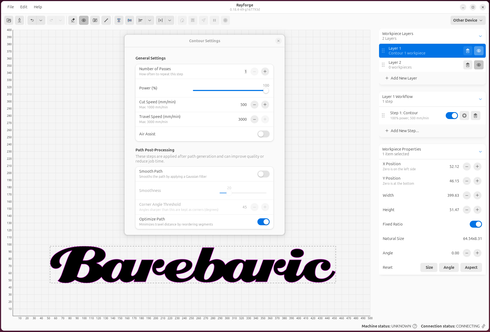

# Rayforge

Rayforge is a software for laser cutters and engravers.
It supports direct communication with GRBL based machines.




## Installation

### Linux

On Linux the only currently supported method is Snap:

[](https://snapcraft.io/rayforge)

You can also install it through PIP if you know what you are doing. Something like this:

```
sudo apt install python3-pip-whl python3-gi gir1.2-gtk-3.0 gir1.2-adw-1 libgirepository-1.0-1 libgirepository-2.0-0 libvips42t64

pip3 install rayforge
```

### Other operating systems

There is currently no installer for other operating systems - contributions are
welcome, in the form of Github workflow actions or build instructions.

If you know what you are doing, you may be able to install manually using
PIP on Windows or Mac - the source code should be fully cross-platform.


## Features

| Feature                          | Description                                             |
| -------------------------------- | ------------------------------------------------------- |
| Intuitive user interface         | Drag & drop reordering, focus on essentials             |
| Multi step operations            | For example, first engrave, then cut                    |
| Mutltiple operation types        | Countour, External Outline, Raster Engraving            |
| High quality path generation     | Interpolation based on spot size, path optimization     |
| Multiple input formats           | SVG, DXF, PDF, and PNG import are supported             |
| Direct device support            | Easily [add support for your own laser](docs/driver.md) |
| Much more                        | Framing, support for air assist, control buttons, ...   |


## Development

Setup:
```
sudo apt install python3-pip-whl python3-gi gir1.2-gtk-3.0 gir1.2-adw-1 libgirepository-1.0-1 libgirepository-2.0-0 libvips42t64
git clone git@github.com:barebaric/rayforge.git
cd rayforge
python3 -m venv venv
source venv/bin/activate
pip install -r requirements.txt
```

### Driver development

If you want to develop a driver to support your machine with Rayforge,
please check the [driver development guide](docs/driver.md).
