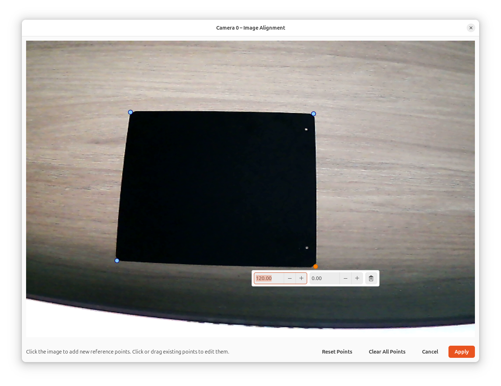
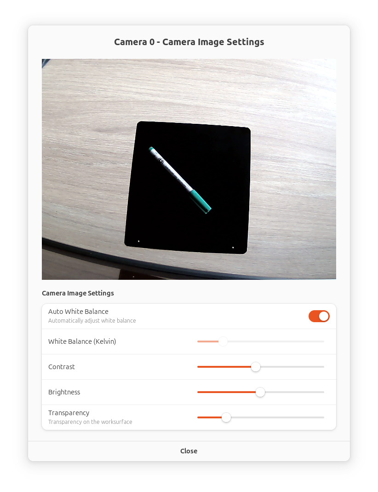
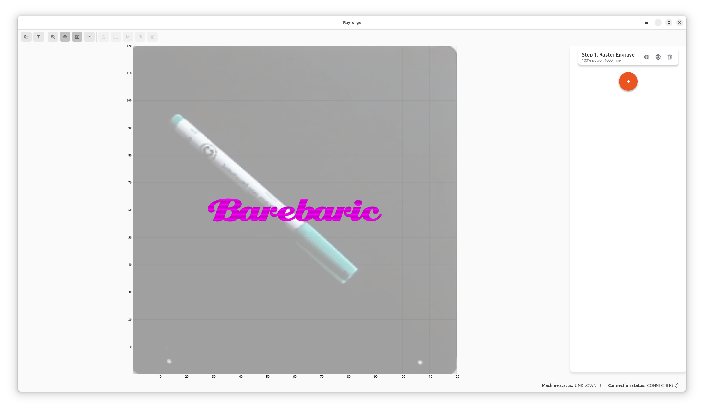
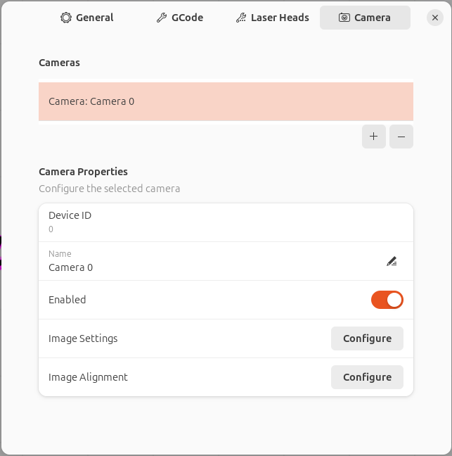

# Rayforge

Rayforge is a software for laser cutters and engravers. It supports Linux, and
since release 0.15.1 also Windows is tested.

It supports direct communication with GRBL based machines (network or serial).


## Features

| Feature                          | Description                                                |
| -------------------------------- | ---------------------------------------------------------- |
| Intuitive user interface         | Drag & drop reordering, focus on essentials                |
| Multi step operations            | For example, first engrave, then cut                       |
| Multiple operation types         | Contour, External Outline, Raster Engraving                |
| High quality path generation     | Interpolation based on spot size, path optimization        |
| Path post processing             | Travel time optimization and path smoothing                |
| Multiple input formats           | SVG, DXF, PDF, and PNG import are supported                |
| Open development                 | Easily [add support for your own laser](docs/driver.md)    |
| Cross-platform                   | Support for Linux and Windows                              |
| Camera support                   | Live camera feed, de-distortion, alignment                 |
| Multi-language support           | English, Portuguese and German are supported               |
| Much more                        | Framing, support for air assist, control buttons, ...      |


## Device support

| Device Type                      | Description                                                  |
| -------------------------------- | ------------------------------------------------------------ |
| GRBL (network based)             | Connect any GRBL based laser through WiFi or Ethernet        |
| GRBL (serial port based)         | Since version 0.13, serial GRBL based machines are supported |
| Smoothieware (Telnet based)      | Starting with version 0.15                                   |


### Screenshots







## Installation

### Linux with Snap

On Linux the only currently supported method is Snap:

[](https://snapcraft.io/rayforge)

To be able to use your camera, you will then have to run this once:

```bash
snap connect rayforge:camera
```

### Linux with PIP

Advanced users may also install it through PIP, but know what you are doing. Something like this:

```bash
sudo apt install python3-pip-whl python3-gi gir1.2-gtk-3.0 gir1.2-adw-1 gir1.2-gdkpixbuf-2.0 libgirepository-1.0-dev libgirepository-2.0-0 libvips42t64 libpotrace-dev libagg-dev

pip3 install rayforge
```

### ~~Linux with Flatpak~~

Unfortunately this does not work yet. I would love for someone to fix it up, see [flatpak](flatpak/).
What would be needed is a Github workflow that publishes the Flatpak. I tried many hours trying
to get this to work, but did not find a way.


### Windows

Head over to the [releases page](https://github.com/barebaric/rayforge/releases/).


### Other operating systems

There is currently no installer for other operating systems - contributions are
welcome, in the form of Github workflow actions or build instructions.

If you know what you are doing, you may be able to install manually using
PIP on Windows or Mac - the source code should be fully cross-platform.


## Development

Setup:
```bash
sudo apt install python3-pip-whl python3-gi gir1.2-gtk-3.0 gir1.2-adw-1 libgirepository-1.0-dev libgirepository-2.0-0 libvips42t64
git clone git@github.com:barebaric/rayforge.git
cd rayforge
python3 -m venv venv
source venv/bin/activate
pip install -r requirements.txt
```

### Driver development

If you want to develop a driver to support your machine with Rayforge,
please check the [driver development guide](docs/driver.md).
